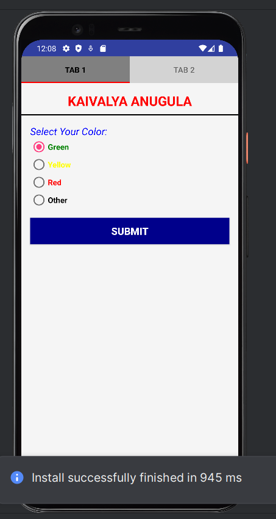
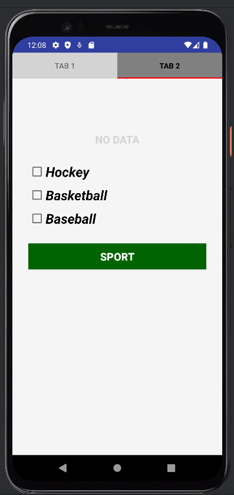

# Kaivalya Anugula - N01659330

This is a TabsLayout Android application that demonstrates fragment communication using ViewPager2 and TabLayout.

## About This Project

A mobile application featuring two tabs with color selection functionality. The first tab allows users to select from Green, Yellow, Red, or Other colors using radio buttons. When submitted, the selected color is passed to the second tab using Fragment Result API. The second tab displays the selected color with appropriate styling and includes sports checkboxes (Hockey, Basketball, Baseball) with an AlertDialog feature.

## Features

- **TabLayout Navigation**: Swipeable tabs using ViewPager2
- **Color Selection**: Radio buttons for selecting colors (Green, Yellow, Red, Other)
- **Fragment Communication**: Pass data between fragments using Fragment Result API
- **Sports Selection**: Checkboxes with AlertDialog display
- **Bilingual Support**: English and French localization

## GitHub Repository

[Repository Link](https://github.com/kaivalyaanugula9330/TabsLayoutLab.git)

## Project Structure

```
TabsLayoutLab/
├── KaivalyaLab6/               # Main app module
│   ├── src/main/
│   │   ├── java/john/smith/tabslayout/
│   │   │   ├── KaivalyaActivity6.java
│   │   │   ├── LeftKa.java
│   │   │   ├── RightAn.java
│   │   │   └── ViewPagerAdapter.java
│   │   └── res/
│   │       ├── layout/
│   │       ├── values/
│   │       └── values-fr/
│   └── build.gradle
├── build.gradle
└── settings.gradle
```

## Technology Stack

- **Language**: Java
- **Framework**: Android SDK
- **UI Components**: Material Design, ViewPager2, TabLayout
- **Architecture**: Fragment-based with ViewPager adapter
- **Min SDK**: 31 (Android 12)
- **Target SDK**: 36

## Getting Started

1. Clone the repository from GitHub
2. Open in Android Studio
3. Sync Gradle files
4. Run on emulator or device

## Screenshots




